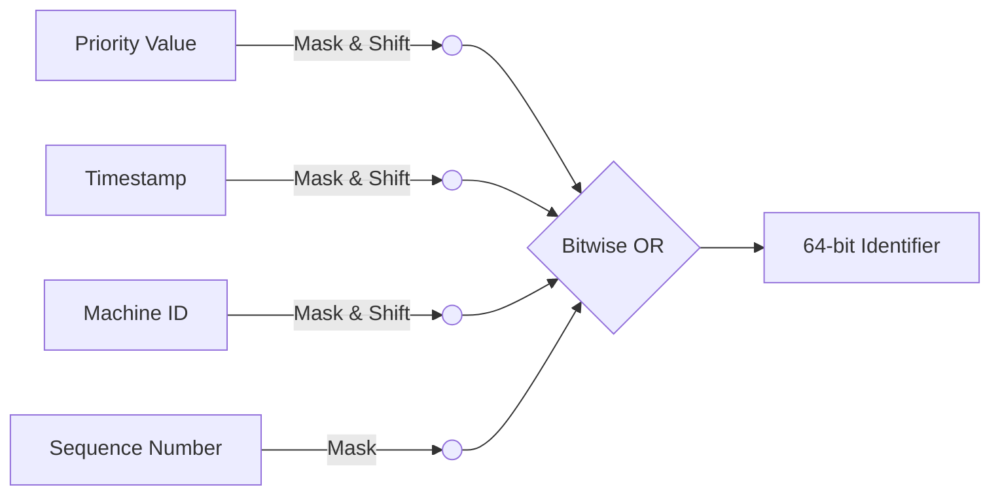
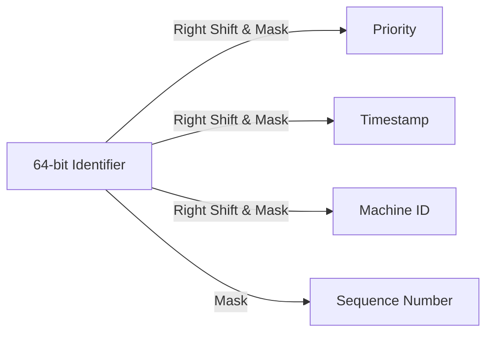

**Title: Gemstone ID: A Unique Identification System with Embedded Priority**

**Abstract**

This paper introduces Gemstone ID, a novel identification system designed to manage unique identifiers while incorporating a priority level within each identifier. The system is inspired by Twitter's Snowflake ID, with modifications to accommodate the priority concept, paralleling the inherent uniqueness and value gradation found among natural gemstones.

**Introduction**

In the realm of digital systems, the efficient management of unique identifiers is paramount, especially in high-volume data and transaction environments. The Twitter Snowflake ID system has gained widespread popularity for its ability to generate unique identifiers in distributed systems. However, a notable limitation of the Snowflake system is its lack of inherent support for incorporating priority levels within each identifier. This limitation has led us to develop Gemstone ID, an enhanced variation of the Snowflake ID that seamlessly integrates priority-based functionalities.

Gemstone ID was specifically conceived to meet the specific demands of a distributed messaging system. Our objective was not only to generate unique message identifiers but also to introduce priority-based and chronological ordering capabilities. Drawing inspiration from the Snowflake ID, we recognized the need to expand its capabilities to address the prioritization and ordering of messages. Our ultimate aim was to devise an identification system that could efficiently manage storage and memory constraints while enabling the prioritization of messages based on their significance and maintaining a clear chronological sequence.

With these goals in mind, Gemstone ID was conceived as a tailored solution to meet the precise requirements of our distributed messaging system. By building upon the foundation of the Snowflake ID, Gemstone ID allows for the generation of unique message IDs that encompass the inherent uniqueness of the Snowflake ID while incorporating the crucial features of priority-based and chronological ordering.

**Gemstone ID System**

The Gemstone ID system is implemented in Python and operates similarly to the Snowflake ID system. It generates 64-bit unique identifiers based on the timestamp, machine ID, and sequence number. However, unlike the original Snowflake system, Gemstone ID includes an additional component: priority.

In Gemstone ID, priority is represented using an integer ranging from 0 to 7, with 0 being the highest priority (akin to the most valuable gemstones) and 7 being the lowest. These priority levels are embedded within the 64-bit identifier, allowing each identifier not only to be unique but also to carry inherent priority information.

The priority, timestamp, machine ID, and sequence number are each masked, shifted, and combined to form the final identifier. The system ensures that identifiers with higher priority are considered 'smaller' in value when compared, mirroring the notion that higher priority tasks are often placed at the front of a queue.

**ID ordering for a messaging system**

The Gemstone ID system is a unique approach to generating IDs, enabling the prioritization of data in addition to maintaining chronological order. It uses a three-part composition for each ID that includes priority, timestamp, and a counter.

1. **Priority**: The priority part of the ID is a distinguishing feature of the Gemstone ID system. By allowing IDs to have an associated priority, this system provides the flexibility to handle data that has varying levels of importance. In certain applications such as real-time data processing or critical system updates, it's essential that higher priority tasks are processed first, regardless of when they were created. With Gemstone ID, higher priority IDs will precede lower priority ones in the ordering, even if the higher priority ID was generated later.

2. **Timestamp**: The timestamp part is in milliseconds and provides a way to order IDs chronologically. It's relative to a custom epoch, which allows for a more efficient use of bits. This means that the IDs are not only unique but also sortable, which is a valuable characteristic in many systems where understanding the order of operations or events is crucial.

3. **Counter**: The counter part increments for each ID generated within the same millisecond for the same priority level. This ensures that even when multiple IDs are generated at the exact same time with the same priority, they remain unique.

To illustrate how this works, consider a scenario where a system is processing messages with Gemstone IDs. If two messages arrive, with the first having a lower priority but an earlier timestamp, and the second having a higher priority but a later timestamp, the system would still process the second message first. This is because the Gemstone ID system prioritizes the 'priority' part over the 'timestamp' part in the ID.

In essence, Gemstone ID system offers a unique and versatile approach to ID generation that's highly applicable in distributed and concurrent systems. It allows for the prioritization of tasks, the chronological ordering of events, and the generation of unique identifiers, all of which are vital in many computational contexts.

**System Mechanism and Important Code Segments**

Delving deeper into the core mechanism, the Gemstone ID system is marked by several vital code segments that ensure its unique functionality.

The heart of the Gemstone ID system lies in the `ID` class, specifically its `to_int` method. The method takes the priority, timestamp, machine ID, and sequence number, and transforms them into a single, unique identifier. Here's how it does that:

```python
def to_int(self):
    p = (self.priority & PRIORITY_BITMASK) << PRIORITY_SHIFT
    t = (self.timestamp - EPOCH) << TIMESTAMP_SHIFT
    m = (self.machine_id & MACHINE_ID_BITMASK) << MACHINE_ID_SHIFT
    s = self.sequence_number & SEQUENCE_BITMASK

    return p | t | m | s
```

This method first masks the priority, timestamp, machine ID, and sequence number with their respective bitmasks. This ensures that each of these values occupies only their designated number of bits. After that, each value is left-shifted by a specific number of bits (determined by `PRIORITY_SHIFT`, `TIMESTAMP_SHIFT`, and `MACHINE_ID_SHIFT`). Finally, these shifted values are combined using the bitwise OR operation to form the final 64-bit identifier.

The masking and shifting process can be visualized as follows:



The `IDGenerator` class plays a crucial role in generating new identifiers. The `get_id` method in this class generates a new ID based on the current timestamp, machine ID, and sequence number. If the current timestamp is less than the last timestamp (indicating that the system clock has moved backwards), an error is raised.

```python
def get_id(self, priority: Priority) -> ID:
    timestamp = time.time_ns() // 1000000
    if timestamp < self.last_timestamp:
        raise ClockMovedBackwardsError("Clock moved backwards!")
    ...
    return ID(priority, timestamp, self.machine_id, self.sequence_number)
```

This feature ensures the monotonically increasing nature of the identifiers, a critical aspect in maintaining their uniqueness.

In the event that the system generates all sequence numbers for a given millisecond (which the `SEQUENCE_BITMASK` allows to be 4096 unique numbers), it will wait until the next millisecond before generating more identifiers. This mechanism, combined with the unique machine ID, allows the system to generate millions of unique identifiers per machine per second.

The Gemstone ID system also provides a method to convert an integer back into an ID object. The `from_int` method in the `ID` class performs this operation:

```python
@classmethod
def from_int(cls, id):
    priority = (id >> PRIORITY_SHIFT) & PRIORITY_BITMASK
    timestamp = ((id >> TIMESTAMP_SHIFT) & ((1 << (PRIORITY_SHIFT - TIMESTAMP_SHIFT)) - 1)) + EPOCH
    machine_id = (id >> MACHINE_ID_SHIFT) & ((1 << (TIMESTAMP_SHIFT - MACHINE_ID_SHIFT)) - 1)
    sequence_number = id & SEQUENCE_BITMASK

    return cls(Priority(priority), timestamp, machine_id, sequence_number)
```

This method reverses the operations performed in `to_int`, using right shifts and masking to extract the original values of priority, timestamp, machine ID, and sequence number from the identifier. The operations can be visualized with the following diagram:



Finally, the `__lt__` and `__eq__` methods in the `ID` class allow for comparison of IDs based on priority, timestamp, machine ID, and sequence number, in that order. This feature is especially useful when IDs are used in a priority queue, where IDs with higher priority (lower numerical value) should be given precedence.

In conclusion, the Gemstone ID system is a robust and efficient mechanism for generating unique identifiers that are not only unique and time-ordered, but also carry a priority level. This allows for the efficient management and processing of tasks in distributed systems, with the assurance of the uniqueness and priority-awareness of each task's identifier.

**Compare to Snowflake ID**

The **Twitter Snowflake ID** and the **Gemstone ID** both offer time-based, unique identifier generation across distributed systems. They use a 64-bit integer to represent the ID, with portions of this integer representing different components of the system. However, there are key differences in their design and functionality:

1. **Inclusion of Priority Level**: The most significant difference lies in the inclusion of a priority level in the Gemstone ID. This priority level allows tasks to be sorted not just by time of creation, but also by their importance. This feature can be critical in systems where task priority can significantly affect system performance or business outcomes. The Twitter Snowflake ID does not provide this feature, focusing only on time-ordering and uniqueness.

2. **Sequence Number Space**: To accommodate the priority level, the Gemstone ID system utilizes a portion of the bits previously allocated to the sequence number in the Twitter Snowflake ID design. As a result, the Gemstone ID might generate fewer IDs per millisecond per node, potentially limiting its utility in extremely high-throughput scenarios.

Both systems share common challenges, such as dependence on clock synchronization, which can lead to issues if not properly managed. However, their design decisions cater to different use cases, and the choice between them would depend on the specific requirements of the system in question.

**System Limitations**

 Like any system, Gemstone ID does have its limitations and potential areas of concern:

1. **Dependence on Clock Synchronization**: The Gemstone ID system, like the Twitter Snowflake ID, is dependent on the synchronization of the system clock. If the clock on a machine is skewed or moves backwards, it can lead to issues such as ID conflicts or the ClockMovedBackwardsError. This system requires careful clock management and synchronization across distributed nodes.

2. **Sequence Number Space**: The Gemstone ID system allocates a portion of the ID bits to the priority level, which reduces the number of bits available for the sequence number. This could potentially limit the number of IDs that can be generated per millisecond per node, especially in high-throughput scenarios.

3. **Priority Level Complexity**: While the inclusion of a priority level provides additional functionality, it also increases the complexity of the ID generation and comparison processes. Developers and systems using Gemstone ID must be prepared to handle this additional complexity.

4. **Fixed Priority Levels**: The Gemstone ID system currently supports 8 priority levels. While this might be adequate for many systems, some use cases might require more granular priority levels.

5. **Hardware Limitations**: The total number of machine IDs that the Gemstone ID system can support is currently 256. While this is likely to be sufficient for many applications, extremely large distributed systems may find this limit restrictive.

These limitations are not insurmountable, and for many systems, the benefits of the Gemstone ID system may well outweigh these potential drawbacks. However, they should be carefully considered when deciding whether to adopt the Gemstone ID system.

**Applications and Implications**

The ability to incorporate priority within identifiers can be particularly useful in systems that deal with tasks or messages of different importance levels. For instance, in a messaging system, an urgent message can be given a higher priority, ensuring that it is processed before lower priority messages.

Furthermore, by embedding the priority within the identifier itself, Gemstone ID eliminates the need for additional data structures or fields to store priority information, thereby enhancing efficiency and reducing complexity.

**Conclusion**

Gemstone ID represents an advancement in identifier management, offering a solution that captures both the uniqueness of identifiers and the importance of task prioritization. By encapsulating these features within a single identifier, Gemstone ID provides an efficient and elegant way to handle unique identification in priority-aware systems. Like the gemstones from which it takes its name, Gemstone ID shines in its ability to distinguish and prioritize tasks, offering a valuable tool in the landscape of digital systems.
